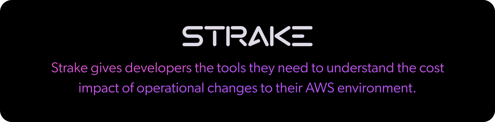

Strake gives developers the tools they need to understand the cost impact of operational changes to their AWS environment. Learn more about our [team](https://www.macroscope.io/company) and check out the current [job openings](https://www.linkedin.com/jobs/view/3178347580/).

## About Strake

- :desktop_computer: [Strake Website](https://getstrake.com/) - visit our website to learn more about Strake's platform.

- :b: [Beta Program](https://getstrake.com/sign-up) - sign up for our Beta Program if your team is spending time trying to cut AWS costs.

- :moneybag: [AWS Pricing](https://github.com/getstrake/aws-pricing) - download our open-source plug-in to analyze public AWS Pricing in Google Sheets.

- :1234: [Cost and Usage Report Analysis](https://github.com/getstrake/developer-cost-guide) - learn how to analyze AWS Billing data with the Developer's Guide to AWS Costs.

## Get in Touch!

Understanding AWS costs is a messy business. If you have questions about the project or want to talk to some AWS cost experts, here are some resources:

- 💭 [Join the Strake community](https://join.slack.com/t/strake-community/shared_invite/zt-1nisfazzn-uO5O_I28Z7N6sZ6iM2H1xA) for any questions, roadmap suggestions, or to say hi!

- :star: [Leave a Star](https://github.com/getstrake/aws-pricing) on our open-source AWS Pricing Plug-in for Google Sheets.

---

Copyright 2023, Strake Technologies.
